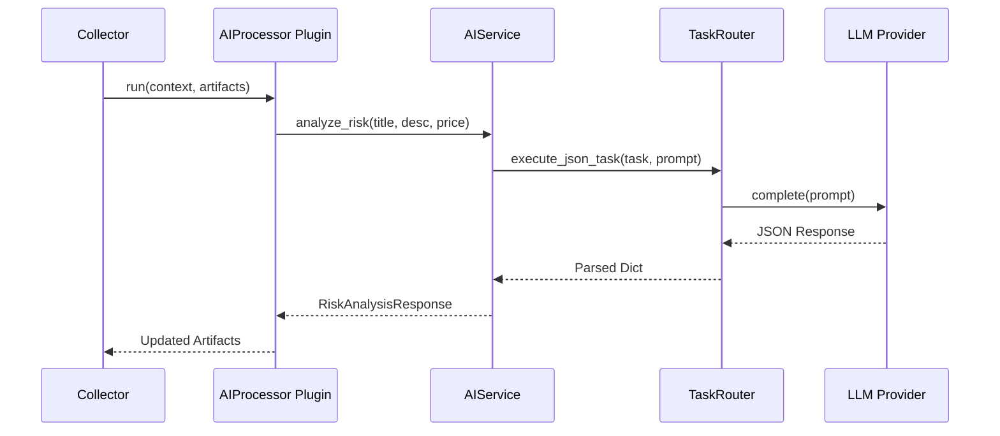

# MAIE AI Integration Architecture

This document describes the design and implementation of the AI integration layer in MAIE.

## Overview

The AI integration layer is designed to be provider-agnostic, modular, and non-blocking. It allows MAIE to leverage Large Language Models (LLMs) for listing enrichment, risk analysis, and decision support without depending on a specific AI service.

## Core Components

The architecture consists of four main components located in `./core/ai/`:

1.  **`BaseAIProvider` (`provider.py`)**: An abstract interface for AI backends.
    *   **`LocalProvider`**: Supports local models via Ollama or similar local APIs.
    *   **`OpenRouterProvider`**: Supports hundreds of models via OpenRouter.
    *   **`HuggingFaceProvider`**: Supports models hosted on Hugging Face Inference API.
2.  **`PromptManager` (`prompt.py`)**: Manages reusable prompt templates with variable substitution. Ensures consistency across different tasks.
3.  **`ResponseParser` (`parser.py`)**: Handles structured data extraction from LLM responses, using Pydantic models for validation.
4.  **`TaskRouter` (`router.py`)**: Dispatches tasks to specific providers based on configuration. Supports per-task provider overrides.

## High-Level Service

**`AIService` (`tasks.py`)** provides a simplified API for the rest of the application. It orchestrates the prompt generation, provider execution, and response parsing.

Supported tasks include:
*   **Title Normalization**: Cleaning up messy marketplace titles.
*   **Description Cleanup**: Summarizing and extracting specs from long descriptions.
*   **Seller Motivation Analysis**: Identifying urgency and negotiability.
*   **Category Classification**: Automatically assigning listings to categories.
*   **Repair Estimation**: Identifying damage and estimating fix costs.
*   **Risk Analysis**: Scoring potential scams or quality issues.
*   **Recommendation Generation**: Providing human-readable "buy/skip" advice.

## Integration with Analysis Pipeline

The AI layer integrates with the existing analysis pipeline via the **`LLMAnalysisPlugin` (`analysis/ai_processor.py`)**.

1.  **Collector** fetches and normalizes a listing.
2.  **ListingContext** is passed to the plugin chain.
3.  **`LLMAnalysisPlugin`** calls `AIService` if enabled.
4.  **AnalysisArtifacts** are enriched with AI-generated data (summaries, recommendations, structured metadata).
5.  **FlipScore** and other components consume the enriched artifacts.

## Configuration

AI features are controlled via `Settings` in `./config/settings.py`:

*   `ai_enabled`: Global toggle.
*   `ai_provider`: Default provider (`local`, `openrouter`, `huggingface`).
*   `ai_model`: Model name (e.g., `llama3`, `gpt-4o`).
*   `ai_api_key`: API key for cloud providers.
*   `ai_base_url`: Custom endpoint for local providers.

## Sequence Diagram

